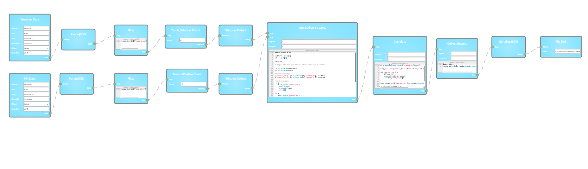
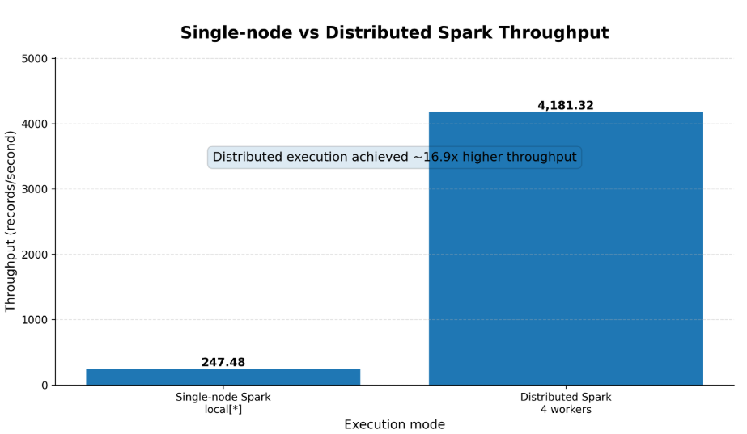

# Kafka-Spark Environmental Sensor ETL Pipeline

This project implements a real-time streaming ETL pipeline using Apache Kafka and Apache Spark. It simulates two environmental sensor streams: weather sensor data and particulate matter sensor data. Spark consumes both Kafka streams, parses JSON records, applies transformations, filters invalid data, performs user-defined processing, joins the streams, calculates correlation, and writes the processed output to a sink.

The project also compares the same pipeline in two execution modes:

- Single-node Spark execution
- Distributed Spark execution with one Spark master and four Spark workers

The goal of this project is to demonstrate real-time data ingestion, stream processing, distributed data processing, and performance benchmarking using Kafka, PySpark, Docker, and Spark.

---

## Architecture

The pipeline contains two Kafka sources: one for weather sensor data and one for particulate matter data. Spark consumes both streams, parses JSON records, filters invalid data, applies window-based aggregation, joins and aligns both streams, calculates correlation, serializes the result as JSON, and writes the final output to a file sink.

## Results: Single-Node vs Distributed Spark Execution

The pipeline was executed in two Spark configurations: single-node Spark execution and distributed Spark execution with one Spark master and four Spark workers.

The throughput comparison shows that the distributed Spark configuration achieves higher throughput than the single-node baseline because the workload is repartitioned and processed across multiple Spark workers.
